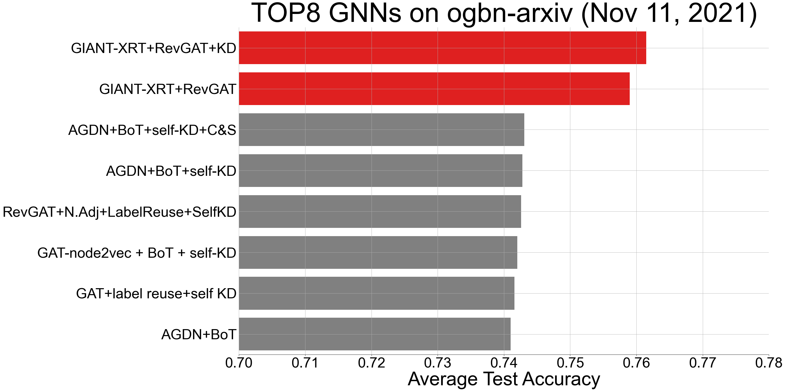
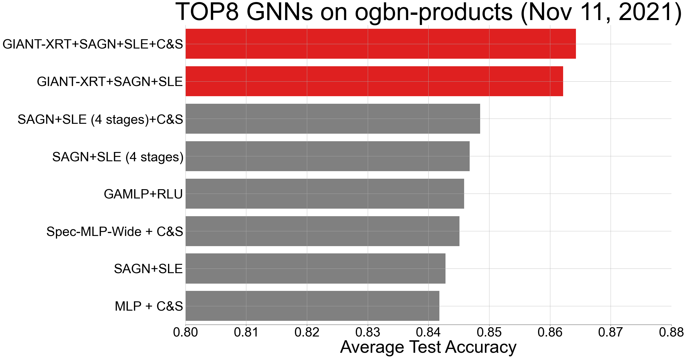
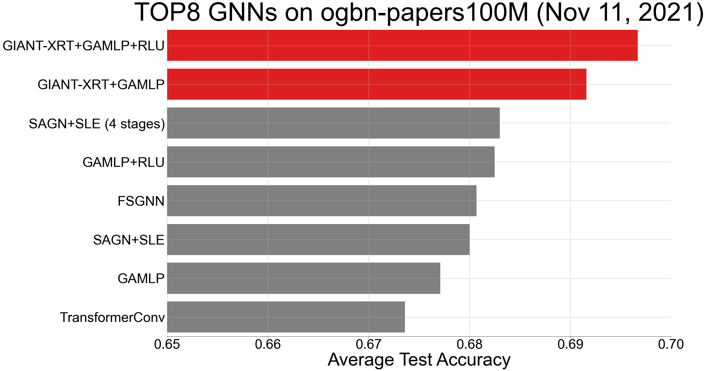

# GIANT-XRT: Node Feature Extraction by Self-supervised Multi-scale Neighborhood Prediction

## Requirement and Install
First let's setup a conda enviroment
```bash
conda create -n "giant-xrt" python=3.8
conda activate giant-xrt
```
Next, we install pytorch and libpecos:
```bash
conda install pytorch==1.9.0 cudatoolkit=10.2 -c pytorch
pip install libpecos==0.2.2
# check the pytorch version and cuda availability
python -c "import torch; print('torch={}, cuda={}'.format(torch.__version__, torch.cuda.is_available()))"
```
Finall, we install GNN related packages
```bash
ptcu_version="1.9.0+cu102"
pip install torch-scatter -f "https://pytorch-geometric.com/whl/torch-${ptcu_version}.html"
pip install torch-sparse -f "https://pytorch-geometric.com/whl/torch-${ptcu_version}.html"
pip install torch-cluster -f "https://pytorch-geometric.com/whl/torch-${ptcu_version}.html"
pip install torch-spline-conv -f "https://pytorch-geometric.com/whl/torch-${ptcu_version}.html"
pip install torch-geometric
pip install ogb==1.3.2
# our ogb version is 1.3.2
python -c "import ogb; from ogb.graphproppred import PygGraphPropPredDataset; print(ogb.__version__)"
```

## Directory Layout
```bash
./giant-xrt
|---- dataset/                      # OGB benchmark datasets
|---- OGB_baselines/                # OGB benchmark GNN models (e.g., mlp, graph-sage, graph-saint)
|        |---- ogbn-arxiv/          	
|        |        |---- mlp.py
|        |        |---- gnn.py
|        |        |---- logger.py
|        |
|        |---- ogbn-products/		
|                |---- mlp.py
|                |---- graph_saint.py
|                |---- logger.py
|
|---- proc_data_xrt/
|        |---- ogbn-arxiv/          # default is empty, artifacts will be downloaded by download_data.sh
|        |---- ogbn-products/       # default is empty, artifacts will be downloaded by download_data.sh
|        |---- download_data.sh
|        |---- vect_config.json     # PECOS TFIDF vectorizer config file
|
|---- proc_data_xrt.py              # create giant-xrt pre-training data
|---- proc_data_xrt.sh
|---- xrt_train.sh                  # pre-training with XR-Transformer in PECOS
|---- xrt_get_emb.sh                # get node embeddings with the fine-tuned XR-Transformer
|---- run_ogb_baselines.sh          # run GNN baselines on OGB benchmark datasets
```


## Download GIANT-XRT Preporcessed Data
This step is required for all remaining sections!
We support three OGB datasets: `ogbn-arxiv`, `ogbn-products`, and `ogbn-papers100M`.
here, consider `ogbn-arxiv` as an example, which can be downloaded via

```bash
cd ./proc_data_xrt
dataset=ogbn-arxiv
bash download_data.sh ${dataset}
cd ../
```

After downloading the pre-processed data, you should see files under the `./proc_data_xrt/ogbn-arxiv/`  folders
```bash
./gaint-xrt
|---- proc_data_xrt/
        |---- download_data.sh
        |---- vect_config.json
        |---- ogbn-arxiv/
                |---- params.json           # hyper-paramters for GIANT-XRT pre-training
                |---- X.all.txt	            # node raw text
                |---- X.all.xrt-emb.npy	    # node embeddings from XR-Transformer
                |---- xrt_models/           # XR-Transformer fine-tined models
```


## Run GNN Baselines on OGB Datasets
For users who only want to take GIANT-XRT node embeddings for running GNN models:
```bash
dataset=ogbn-arxiv	# can be either ogbn-arxiv, ogbn-products, ogbn-papers100M
# for ogbn-arxiv: mlp/graph-sage
# for ogbn-products: mlp/graph-saint;
# for ogbn-papers100M: mlp/sgc;
gnn_algo=mlp
bash ./run_ogb_baselines.sh ${dataset} ${gnn_algo}
```

### Results
For `ogbn-arxiv` and `ogbn-products`, we report the mean/std of 10 runs.
For `ogbn-papers100M`, we report the mean/std of 5 runs.

| ogbn-arxiv | MLP | GraphSAGE |
|---|---|---|
| Test accuracy (%) | 73.06 ± 0.11 | 74.35 ± 0.14 |

| ogbn-products | MLP | GraphSAINT |
|---|---|---|
| Test accuracy (%) | 80.49 ± 0.28 | 84.15 ± 0.22 |

| ogbn-papers100M | MLP | SGC |
|---|---|---|
| Test accuracy (%) | 61.06 ± 0.13 | 66.19 ± 0.24 |


**Remark**: Note that we do not fix random seed as in the original OGB implementation. So the results can be slightly different (usually within 1 std).


## Run SOTA GNNs with GIANT-XRT on OGB Datasets

For **ogbn-arxiv**, please check this [Repo](https://github.com/elichienxD/deep_gcns_torch).
<p align="center">
    
</p>

For **ogbn-products**, please check this [Repo](https://github.com/elichienxD/SAGN_with_SLE).
<p align="center">
    
</p>

For **ogbn-papers100M**, please check this [Repo](https://github.com/OctoberChang/GAMLP).
<p align="center">
    
</p>


## Pre-training with GIANT-XRT
This subsection is for advanced users who want to run the pre-training procedure.

### Create Pre-training Data
```bash
dataset=ogbn-arxiv
bash proc_data_xrt.sh ${dataset}
```

### Pre-training GIANT-XRT
```bash
data_dir=./proc_data_xrt/ogbn-arxiv
bash xrt_train.sh ${data_dir}
```

### Get Node Embeddings by GIANT-XRT
```bash
bash xrt_get_emb.sh ${data_dir}
```

## Citation
If you find this useful, please consider citing our paper.
```
@article{chien2021node,
  title={Node Feature Extraction by Self-Supervised Multi-scale Neighborhood Prediction},
  author={Eli Chien and Wei-Cheng Chang and Cho-Jui Hsieh and Hsiang-Fu Yu and Jiong Zhang and Olgica Milenkovic and Inderjit S Dhillon},
  journal={arXiv preprint arXiv:2111.00064},
  year={2021}
}
```
