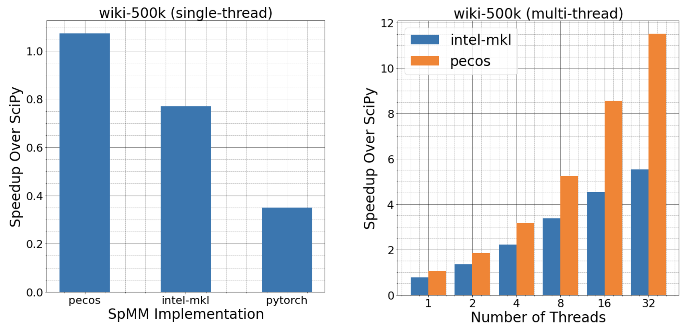
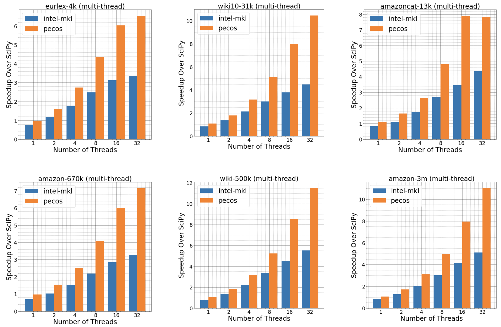
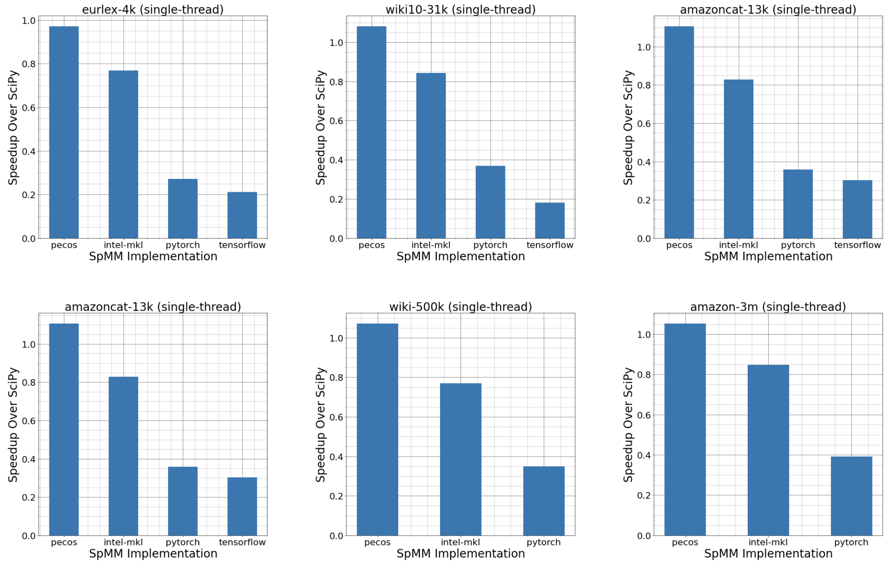

# PECOS for Sparse-to-Sparse Matrix Multiplication (SpMM)
**Sp**arse-to-sparse **M**atrix **M**ultiplication (**SpMM**) is one of the key primitives in large-scale linear algebra operations, with a broad range of applications in machine learning and natural language processing. For example, a graph convolution step on sparse input features involves a SpMM operation. Another usage of SpMM is the computation of PIFA features in e**X**treme **M**ulti-label **C**lassification (**XMC**) community that aggregate sparse input TFIDF features associated with a label as its label embedding.

However, to the best of our knowledge, very few linear algebra libraries support **SpMM** with fast parallelism on CPU machines. Therefore, we enable PECOS with a highly optimized multi-core CPU implementation for the **SpMM** operation. See the [Python API usage](#Python-API-Usage) and [Benchmarking Results](#Benchmarking-Results) for more details.

<p align="center">
    
</p>


## Requirements and Installation 
To use PECOS SpMM functionality without comparing to baselines, just pip install libpecos.
``` bash
    pip install libpecos
```

## Python API Usage

Perform a **CPU parallel** SpMM operation of the sparse matrix `X` and the sparse matrix `Y`.
``` python
>>> from pecos.core import clib as pecos_clib
>>> Z = pecos_clib.sparse_matmul(X, Y, eliminate_zeros=False, sorted_indices=True, threads=-1)
```

### Parameters
- `X` ([`scipy.sparse.csr_matrix`](https://docs.scipy.org/doc/scipy/reference/generated/scipy.sparse.csr_matrix.html) or [`scipy.sparse.csc_matrix`](https://docs.scipy.org/doc/scipy/reference/generated/scipy.sparse.csc_matrix.html)): the first *sparse* matrix to be multiplied.
- `Y` ([`scipy.sparse.csr_matrix`](https://docs.scipy.org/doc/scipy/reference/generated/scipy.sparse.csr_matrix.html) or [`scipy.sparse.csc_matrix`](https://docs.scipy.org/doc/scipy/reference/generated/scipy.sparse.csc_matrix.html)): the second *sparse* matrix to be multiplied.
- `eliminate_zeros` (bool, optional): if true, then eliminate (potential) zeros created by maxnnz in output matrix Z. Default is false.
- `sorted_indices` (bool, optional): if true, then sort the Z.indices for the output matrix Z. Default is true.
- `threads` (int, optional): The number of threads. Default -1 to use all CPU cores.

### Toy Examples
``` python
>>> import numpy as np
>>> import scipy.sparse as smat
>>> from scipy.sparse import linalg
>>> from pecos.core import clib as pecos_clib
>>> X = smat.random(1000, 1000, density=0.01, format='csr', dtype=np.float32)
>>> Y = smat.random(1000, 1000, density=0.01, format='csr', dtype=np.float32)
>>> Z_true = X.dot(Y)
>>> Z_pred = pecos_clib.sparse_matmul(X, Y)
>>> print("||Z_true - Z_pred|| = ", linalg.norm(Z_true - Z_pred))
```

## Benchmarking Results
We compare PECOS running time with a few popular linear algebra packages, including SciPy, Intel-MKL, Pytorch, and Tensorflow.
* Intel-MKL: `pip install sparse-dot-mkl==0.7.3` (Note that it requires MKL library, see [link](https://github.com/flatironinstitute/sparse_dot#requirements)) 
* PECOS: `pip install libpecos==0.1.0`
* Pytorch: `pip install torch==1.9.0+cpu`
* Tensorflow: `pip install tensorflow==2.5.0` 

All the experiment results are conducted on a AWS [x1.32xlarge](https://aws.amazon.com/ec2/instance-types/x1/) instance with 128 CPU and 1.9T memory.
We note that Pytorch and Tensoflow results are from the same CPU machine without using any GPU.

### Requirements
We also provide the conda environment with the those libraries installed for you to reproduce the results
``` bash
    conda env create -f conda_env.yml
    conda activate pecos-spmm
```

### Problem Setup
We consider benchmarking the SpMM operation `Z=(Y.T).dot(X)`, where
* `X` is the sparse instance-to-feature TFIDF matrix of shape `N by D`
* `Y` is the sparse instance-to-label relevant matrix of shape `N by L`

The input matrices are from public XMC benchmark datasets as follows.

### Data Statistics
The XMC datasets can be download at
``` bash
# eurlex-4k, wiki10-31k, amazoncat-13k, amazon-670k, wiki-500k, amazon-3m
DATASET="wiki10-31k"
wget https://archive.org/download/pecos-dataset/xmc-base/${DATASET}.tar.gz
tar -zxvf ./${DATASET}.tar.gz
```

| Data | N (#instance) | D (#feature) | L (#label) | nnz(X) | nnz(Y) | nnz(Z)
| :---- | ----: | ----: | ----: | ----: | ----: |----: |
| eurlex-4k     |    15,449 |   186,104 |     3,956 |   4,194,123 |     82,265 |     6,126,348
| wiki10-31k    |    14,146 |   101,938 |    30,938 |   9,526,572 |    263,705 |    72,574,211
| amazoncat-13k | 1,186,239 |   203,882 |    13,330 |  84,415,397 |  5,979,439 |    33,409,040
| amazon-670k   |   490,449 |   135,909 |   670,091 |  37,119,040 |  2,674,356 |   146,741,011
| wiki-500k     | 1,779,881 | 2,381,304 |   501,070 | 689,526,754 |  8,446,236 | 1,255,206,075
| amazon-3m     | 1,717,899 |   337,067 | 2,812,281 |  84,600,285 | 61,916,857 | 1,375,859,565 

From the following, we assume all ${DATASET} sub-folders are located at `./data/${DATASET}` 


### Multi-thread Comparison
``` bash
bash run_exp.sh ${DATASET} multi-thread
```

<p align="center">
    
</p>

### Single-thread Comparison
``` bash
bash run_exp.sh ${DATASET} single-thread
```
<p align="center">
    
</p>


